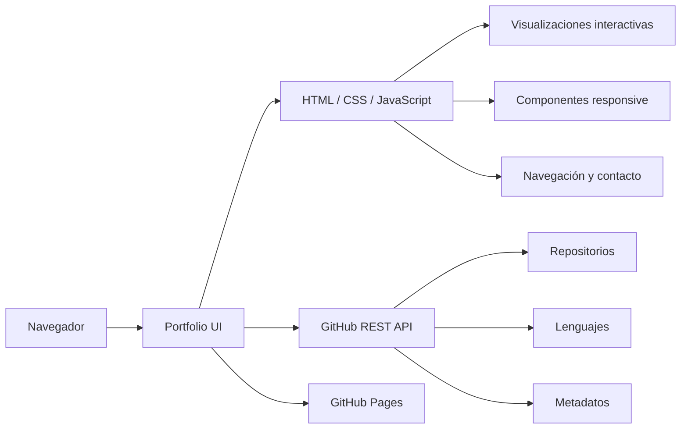

<div align="center">

# Sergio Jiménez Macías — Portfolio de Ingeniería

### Software · Sistemas · Infraestructura · Computación Distribuida · Ciberseguridad

[](https://seergiojm23.github.io/)
[](https://pages.github.com/)
[](https://developer.mozilla.org/es/docs/Web/JavaScript)
[](#interfaz-y-experiencia)

**Portfolio profesional de ingeniería orientado a presentar competencias técnicas, proyectos seleccionados, experiencia profesional y código publicado mediante una interfaz web rápida, responsive e interactiva.**

[🌐 Ver portfolio](https://seergiojm23.github.io/) · [👨‍💻 Perfil de GitHub](https://github.com/seergiojm23)

</div>

---

## Descripción

`seergiojm23.github.io` contiene el código fuente de mi portfolio profesional de ingeniería.

El sitio combina una **arquitectura front-end estática** con consumo de datos públicos mediante la **GitHub REST API**, visualizaciones interactivas y una interfaz responsive. Su objetivo es ofrecer una visión técnica estructurada de mi trabajo en desarrollo software, sistemas, infraestructura, computación distribuida y ciberseguridad.

La implementación está construida con **HTML5, CSS3 y JavaScript nativo**, sin dependencia de frameworks front-end.

---

## Interfaz y experiencia

El portfolio está estructurado alrededor de la información más relevante para perfiles técnicos y procesos de selección:

| Área | Contenido |
|---|---|
| **Competencias** | Capacidades de ingeniería organizadas por dominio técnico |
| **Proyectos** | Implementaciones y trabajos técnicos seleccionados |
| **Experiencia** | Responsabilidades profesionales y tecnologías aplicadas |
| **Tecnologías** | Lenguajes, plataformas, infraestructura y tooling |
| **GitHub** | Código publicado y repositorios disponibles |
| **Contacto** | Canales profesionales y acceso al CV |

### Características de interfaz

- Diseño responsive para escritorio, tablet y móvil
- Visualizaciones técnicas animadas
- Elementos dinámicos y métricas de interfaz en tiempo real
- Integración con metadatos públicos de GitHub
- Progressive enhancement y degradación controlada ante fallos de API
- Navegación semántica e interacciones accesibles por teclado
- Identidad visual técnica con movimiento controlado
- Metadatos Open Graph y recursos para previsualización social
- Favicon personalizado, manifest y página `404`

---

## Arquitectura



La aplicación se despliega como sitio estático mediante **GitHub Pages**. Los metadatos públicos de GitHub se obtienen desde el cliente y se integran en la interfaz sin necesidad de un backend propio.

---

## Stack tecnológico

<div align="center">


</div>

### Front-end

`HTML5` · `CSS3` · `JavaScript ES6+` · `Canvas/SVG` · `Responsive Design`

### Integración

`GitHub REST API` · `Fetch API` · `JSON` · `Browser APIs`

### Entrega y despliegue

`Git` · `GitHub` · `GitHub Pages` · `Open Graph` · `Web App Manifest`

---

## Flujo de ejecución

```text
GitHub Pages
     │
     ▼
Portfolio estático
     │
     ├──► Perfil profesional
     ├──► Competencias técnicas
     ├──► Proyectos de ingeniería
     ├──► Experiencia profesional
     ├──► Stack tecnológico
     │
     └──► GitHub REST API
              │
              ├── repositorios
              ├── lenguajes
              └── metadatos
```

Los datos externos enriquecen la interfaz, pero el contenido principal del portfolio permanece disponible de forma independiente a la respuesta de la API de GitHub.

---

## Estructura del proyecto

```text
.
├── index.html
├── 404.html
├── favicon.svg
├── apple-touch-icon.png
├── og-card.png
├── site.webmanifest
├── robots.txt
├── sitemap.xml
└── README.md
```

`index.html` contiene la interfaz principal, los estilos y el comportamiento del lado cliente. El resto de archivos proporciona metadatos de despliegue, directivas para buscadores, recursos de previsualización social e integración con el navegador.

---

## Decisiones de ingeniería

### Front-end sin framework

La aplicación está implementada sin framework JavaScript para mantener una arquitectura ligera, reducir dependencias y simplificar el modelo de despliegue de un portfolio estático.

### Progressive enhancement

El contenido profesional principal se renderiza de forma independiente a las respuestas de servicios externos. Los metadatos dinámicos y visualizaciones enriquecen la experiencia sin convertirse en un requisito para la navegación básica.

### Integración con GitHub

La información pública de los repositorios se obtiene directamente desde GitHub para incorporar metadatos actualizados del código publicado.

### Diseño responsive

La interfaz adapta su composición a distintos tamaños de pantalla preservando jerarquía visual, legibilidad y navegación.

### Movimiento controlado

Las animaciones funcionan como capa visual complementaria y no condicionan el acceso al contenido. Se contemplan preferencias de reducción de movimiento cuando el navegador las expone.

---

## Despliegue

La versión de producción se publica directamente desde este repositorio mediante **GitHub Pages**.

<div align="center">

### [→ seergiojm23.github.io](https://seergiojm23.github.io/)

</div>

Los cambios integrados en la rama de publicación se reflejan en el sitio una vez completado el despliegue de GitHub Pages.

---

## Autor

<div align="center">

### Sergio Jiménez Macías

**Ingeniería Informática · Software · Sistemas · Infraestructura · Computación Distribuida · Ciberseguridad**

[](https://github.com/seergiojm23)
[](https://seergiojm23.github.io/)

</div>
